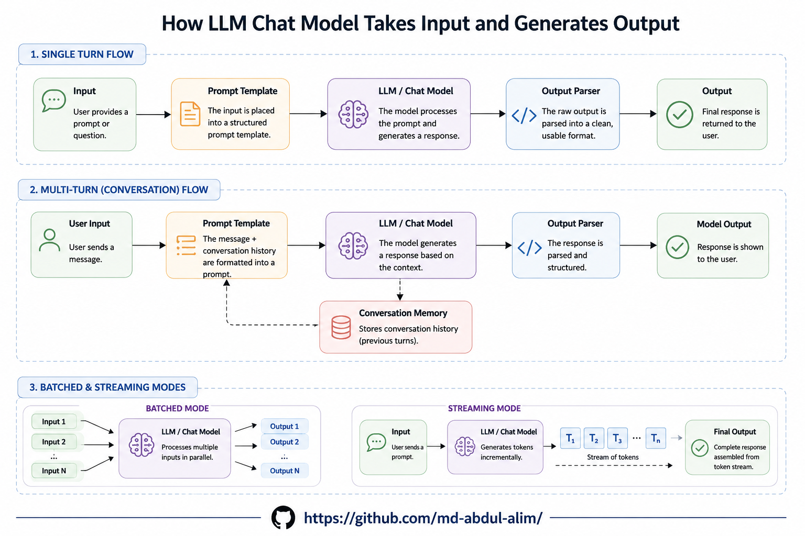
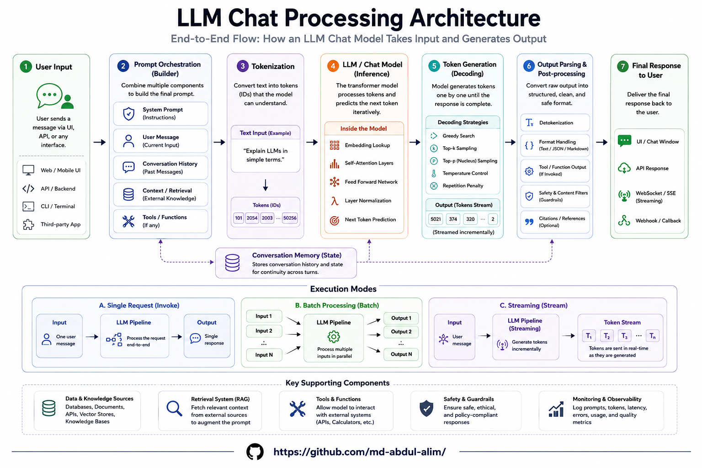
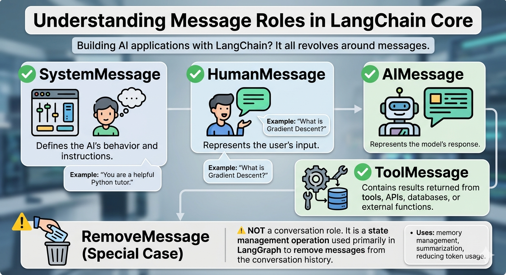
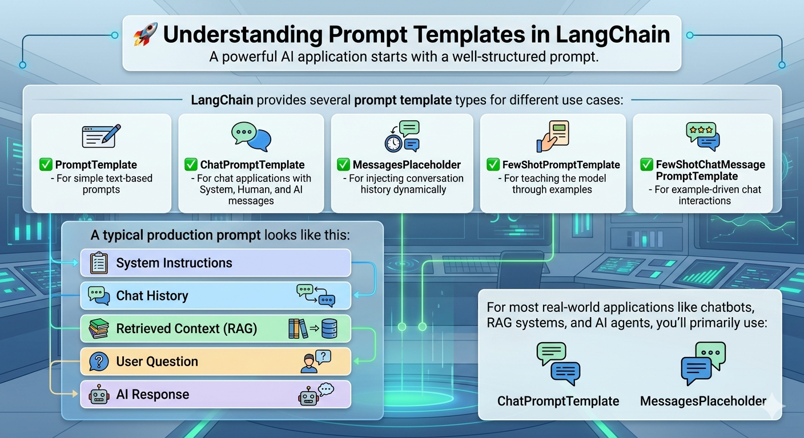
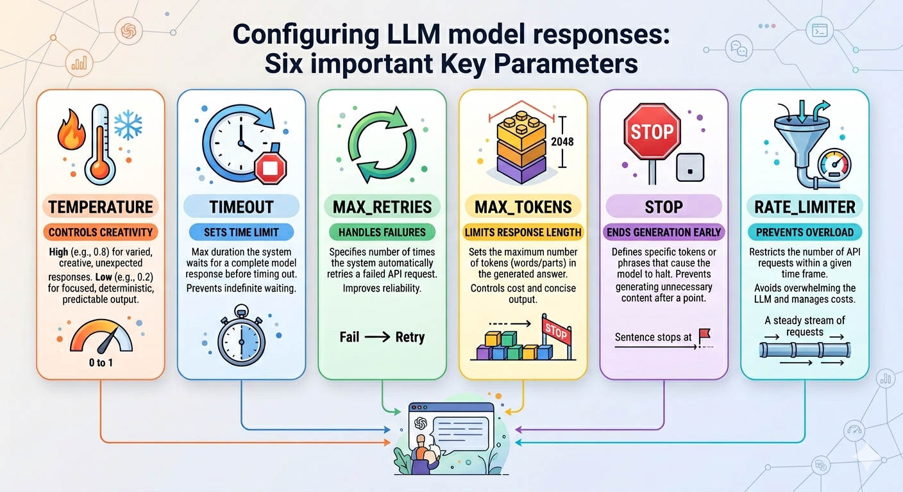

🔹 Understanding Message Roles in LangChain Core

When building AI applications with LangChain, everything revolves around messages. But not all messages are the same.

✅ SystemMessage
Defines the AI's behavior and instructions.
Example: "You are a helpful Python tutor."

✅ HumanMessage
Represents the user's input.
Example: "What is Gradient Descent?"

✅ AIMessage
Represents the model's response.

✅ ToolMessage
Contains results returned from tools, APIs, databases, or external functions.

⚠️ RemoveMessage (Special Case)

Unlike the others, RemoveMessage is NOT a conversation role.

It is a state management operation used primarily in LangGraph to remove messages from the conversation history. This is useful for memory management, summarization, and reducing token usage in long-running agent workflows.

Think of it this way:

🧑 HumanMessage → User says something
🤖 AIMessage → Model responds
⚙️ ToolMessage → Tool returns data
📋 SystemMessage → Sets the rules
🗑️ RemoveMessage → Deletes old messages from state

Understanding these message types is essential when building production-grade agents and workflows with LangChain and LangGraph.


# Prompt Templates

## Prompt Templates in LangChain Core

Prompt templates are one of the most important concepts in LangChain. They help create dynamic prompts by inserting variables, conversation history, examples, and retrieved context before sending requests to an LLM.

---

## Why Use Prompt Templates?

Instead of hardcoding prompts:

```python
prompt = "Explain Gradient Descent"
```

You can create reusable templates:

```python
prompt = "Explain {topic}"
```

And inject values dynamically:

```python
topic = "Gradient Descent"
```

Result:

```text
Explain Gradient Descent
```

---

## 1. PromptTemplate

Used for simple text prompts.

## Example

```python
from langchain_core.prompts import PromptTemplate

prompt = PromptTemplate(
    template="Explain {topic} in simple terms.",
    input_variables=["topic"]
)

result = prompt.invoke({
    "topic": "Gradient Descent"
})

print(result.text)
```

Output:

```text
Explain Gradient Descent in simple terms.
```

---

## 2. ChatPromptTemplate

Used for chat models such as GPT, Claude, Gemini, and others.

## Example

```python
from langchain_core.prompts import ChatPromptTemplate

prompt = ChatPromptTemplate.from_messages([
    (
        "system",
        "You are a helpful AI tutor."
    ),
    (
        "human",
        "{question}"
    )
])

messages = prompt.invoke({
    "question": "What is LangGraph?"
})

print(messages)
```

Generated Messages:

```python
[
    SystemMessage(
        content="You are a helpful AI tutor."
    ),
    HumanMessage(
        content="What is LangGraph?"
    )
]
```

---

## 3. MessagesPlaceholder

Used to inject chat history dynamically.

## Example

```python
from langchain_core.prompts import (
    ChatPromptTemplate,
    MessagesPlaceholder
)
from langchain_core.messages import (
    HumanMessage,
    AIMessage
)

prompt = ChatPromptTemplate.from_messages([
    (
        "system",
        "You are a helpful assistant."
    ),
    MessagesPlaceholder("history"),
    (
        "human",
        "{question}"
    )
])

messages = prompt.invoke({
    "history": [
        HumanMessage(content="Hello"),
        AIMessage(content="Hi! How can I help?")
    ],
    "question": "What is LangGraph?"
})
```

Result:

```python
[
    SystemMessage(...),
    HumanMessage("Hello"),
    AIMessage("Hi! How can I help?"),
    HumanMessage("What is LangGraph?")
]
```

---

## 4. FewShotPromptTemplate

Used when you want to teach the model through examples.

## Example

```python
from langchain_core.prompts import (
    PromptTemplate,
    FewShotPromptTemplate
)

examples = [
    {
        "input": "2+2",
        "output": "4"
    },
    {
        "input": "3+3",
        "output": "6"
    }
]

example_prompt = PromptTemplate(
    template="Input: {input}\nOutput: {output}",
    input_variables=["input", "output"]
)

few_shot_prompt = FewShotPromptTemplate(
    examples=examples,
    example_prompt=example_prompt,
    suffix="Input: {input}",
    input_variables=["input"]
)

result = few_shot_prompt.invoke({
    "input": "5+5"
})
```

Generated Prompt:

```text
Input: 2+2
Output: 4

Input: 3+3
Output: 6

Input: 5+5
```

---

## 5. FewShotChatMessagePromptTemplate

Used for chat-based few-shot prompting.

## Example

```python
from langchain_core.prompts import (
    ChatPromptTemplate,
    FewShotChatMessagePromptTemplate
)
```

Commonly used in AI agents and advanced chatbot workflows.

---

# Common Production Prompt Structure

Most real-world AI applications follow this structure:

```text
System Instructions
│
├── Role Definition
├── Rules
├── Constraints
├── Output Format
│
Conversation History
│
Retrieved Context (RAG)
│
User Question
│
Final Response
```

Example:

```python
from langchain_core.prompts import (
    ChatPromptTemplate,
    MessagesPlaceholder
)

prompt = ChatPromptTemplate.from_messages([
    (
        "system",
        """
        You are a senior Python tutor.

        Rules:
        - Explain simply
        - Use examples
        - Use markdown
        """
    ),

    MessagesPlaceholder("history"),

    (
        "human",
        """
        Context:
        {context}

        Question:
        {question}
        """
    )
])
```

---

## Most Commonly Used Templates

| Template                         | Purpose                    |
| -------------------------------- | -------------------------- |
| PromptTemplate                   | Simple text prompts        |
| ChatPromptTemplate               | Chat applications          |
| MessagesPlaceholder              | Conversation history       |
| FewShotPromptTemplate            | Example-based learning     |
| FewShotChatMessagePromptTemplate | Example-based chat prompts |

---


```python
ChatPromptTemplate
MessagesPlaceholder
```

These two classes form the foundation of most LangChain applications.


# Configuring Models in LangChain


When working with Large Language Models (LLMs) in LangChain, model configuration is an important step that helps control response quality, reliability, performance, and cost.

Understanding these parameters is a common interview topic for LangChain developers.

---

# Temperature

## What is Temperature?

Temperature controls the randomness and creativity of model responses.

### Low Temperature

A low temperature produces:

* More deterministic responses
* More consistent outputs
* More factual answers
* Better results for structured tasks

**Common Use Cases**

* Question Answering
* Retrieval-Augmented Generation (RAG)
* Data Extraction
* Summarization
* Coding Assistants

### High Temperature

A high temperature produces:

* More creative responses
* More diverse outputs
* Greater variation between responses

**Common Use Cases**

* Content Writing
* Brainstorming
* Story Generation
* Marketing Copy

### Interview Answer

Temperature controls the randomness of the model. Lower values generate more predictable and factual responses, while higher values increase creativity and output diversity.

---

# Timeout

## What is Timeout?

Timeout defines the maximum amount of time the application waits for a model response.

If the model does not respond within the configured time, the request is terminated and an error is returned.

### Why is it Important?

Timeout prevents applications from:

* Hanging indefinitely
* Waiting for slow API responses
* Becoming unresponsive due to network issues

### Interview Answer

Timeout specifies how long LangChain should wait for a model response before cancelling the request. It improves application reliability by preventing long-running or stuck requests.

---

# Max Retries

## What is Max Retries?

Max Retries determines how many times LangChain automatically retries a failed request.

Retries are useful for temporary issues such as:

* Rate limit errors
* Network interruptions
* Provider-side failures
* Temporary service outages

### Why is it Important?

Automatic retries improve system reliability without requiring manual intervention.

### Interview Answer

Max Retries defines the number of automatic retry attempts LangChain performs when a request fails due to temporary errors. It helps make applications more resilient.

---

# Max Tokens

## What is Max Tokens?

Max Tokens limits the maximum length of the generated response.

The value controls how much text the model can produce.

### Benefits

* Controls API costs
* Prevents excessively long responses
* Improves response speed
* Helps maintain predictable output sizes

### Interview Answer

Max Tokens limits the number of tokens generated by the model. It is commonly used to control response length, cost, and performance.

---

# Stop Sequences

## What are Stop Sequences?

Stop Sequences are predefined strings that instruct the model to stop generating text when encountered.

They help developers control output boundaries.

### Common Use Cases

* Agent workflows
* Structured outputs
* JSON generation
* Multi-step reasoning systems
* Prompt engineering

### Benefits

* Prevents unnecessary text generation
* Improves output formatting
* Makes parsing easier

### Interview Answer

Stop Sequences are specific strings that terminate model generation when encountered. They are used to control response structure and output length.

---

# Rate Limiter

## What is a Rate Limiter?

A Rate Limiter controls how frequently requests are sent to the LLM provider.

Most AI providers enforce API usage limits based on:

* Requests per second
* Requests per minute
* Requests per hour

### Why is it Important?

Without rate limiting, applications may encounter:

* Rate limit errors (429)
* Service throttling
* Reduced reliability
* API quota violations

### Benefits

* Prevents excessive API requests
* Protects application stability
* Ensures compliance with provider limits
* Improves production reliability

### Interview Answer

A Rate Limiter controls the frequency of requests sent to the model provider. It helps prevent rate-limit errors, maintain system stability, and comply with API usage restrictions.

---

# Quick Interview Summary

| Parameter      | Purpose                               |
| -------------- | ------------------------------------- |
| Temperature    | Controls randomness and creativity    |
| Timeout        | Limits waiting time for responses     |
| Max Retries    | Automatically retries failed requests |
| Max Tokens     | Limits response length                |
| Stop Sequences | Controls when generation stops        |
| Rate Limiter   | Controls request frequency            |

---

# 30-Second Interview Answer

When configuring a model in LangChain, I typically use Temperature to control creativity, Max Tokens to limit response length, Timeout to prevent long-running requests, Max Retries to handle temporary failures, Stop Sequences to control output structure, and a Rate Limiter to avoid exceeding provider API limits. Together, these settings help balance quality, reliability, performance, and cost.

---
# Structured Output

# What is Structured Output in LLM Applications?

Structured Output is a technique that forces an LLM to return data in a predefined format, such as JSON, a Pydantic model, or a TypedDict, instead of generating free-form text.

### Why do we use Structured Output?

In many AI applications, the response is not intended for a human to read directly. Instead, the output needs to be consumed by code, APIs, databases, or workflow systems. Structured Output ensures that the response follows a predictable schema that applications can process reliably.

### Common Use Cases

1. Information Extraction

   * Extract names, emails, phone numbers, skills, and dates from unstructured text.

2. Resume parsing

3. Invoice extraction

4. Contact form processing

5. Lead generation

6. Tool Calling and Agents

   * Generate parameters required for API calls or tool execution.

7. Database Operations

   * Convert user requests into structured records for storage.

8. Classification Tasks

   * Return sentiment, intent, categories, or labels.

9. LangGraph State Management

   * Update graph state with validated fields.

### Example

Instead of returning:

"The user's name is John and he is 30 years old."

Structured Output returns:

{
"name": "John",
"age": 30
}

which can be directly used by the application.

### Benefits

* Reliable parsing
* Reduced post-processing
* Better validation
* Easier integration with APIs and databases
* Improved agent workflows

### In LangChain

Structured Output can be implemented using:

* Pydantic Models
* TypedDict
* JSON Schema

and configured using:

with_structured_output()

### When Not to Use It

Structured Output is generally unnecessary when generating content intended for human consumption, such as:

* Blog posts
* Emails
* Documentation
* LinkedIn posts
* General explanations

In short, use Structured Output whenever the response will be consumed by software rather than directly by a human.
