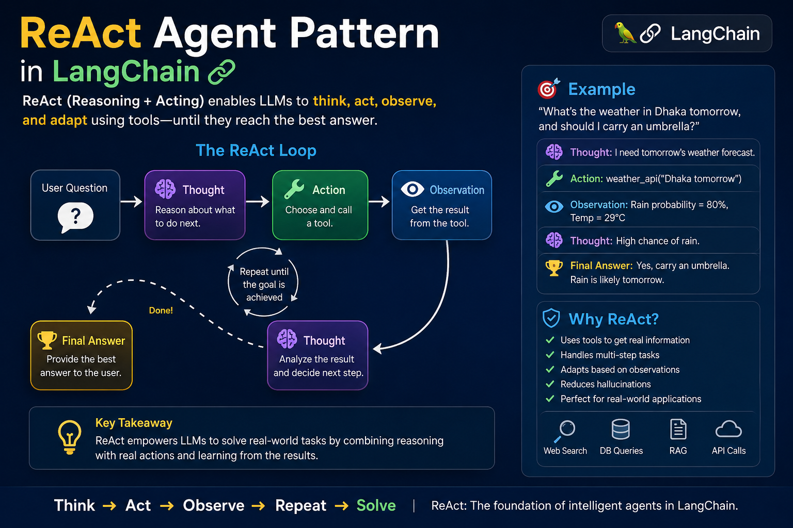

# ReAct Agent Pattern in LangChain – Complete Interview Notes

## What is ReAct?

ReAct stands for:

**Re = Reasoning**
**Act = Acting**

ReAct is an agent pattern where an LLM alternates between:

1. Reasoning about the problem
2. Taking an action (calling a tool)
3. Observing the result
4. Reasoning again

This cycle continues until the final answer is produced.

---

## Why ReAct Was Introduced

Traditional LLMs have a limitation:

* They only generate text.
* They cannot access real-time information.
* They may hallucinate facts.

Example:

Question:
"What is the current weather in Dhaka?"

A normal LLM may guess.

A ReAct Agent:

* Understands it needs weather data
* Calls a weather API
* Gets the result
* Generates an accurate response

This makes the system more reliable.

---

# Core ReAct Loop

The fundamental workflow is:

```text
User Query
    ↓
Thought
    ↓
Action
    ↓
Observation
    ↓
Thought
    ↓
Action
    ↓
Observation
    ↓
Final Answer
```

---

# Step-by-Step Example

User asks:

"What is the population of Bangladesh divided by 2?"

Agent execution:

### Thought

I need the population of Bangladesh.

### Action

Search Tool

```python
search("population of Bangladesh")
```

### Observation

Population = 173 million

### Thought

Now I need to divide it by 2.

### Action

Calculator Tool

```python
calculator(173000000 / 2)
```

### Observation

86.5 million

### Final Answer

Bangladesh's population divided by 2 is approximately 86.5 million.

---

# Components of a ReAct Agent

## 1. LLM

Responsible for reasoning.

Examples:

* GPT-5
* GPT-4o
* Claude
* Gemini

---

## 2. Tools

External capabilities.

Examples:

* Web Search
* Database Query
* Calculator
* Weather API
* Internal APIs
* RAG Retriever

Without tools, ReAct is not very useful.

---

## 3. Memory (Optional)

Stores conversation context.

Example:

User:
"My name is Hasan."

Later:

"What is my name?"

Agent can answer using memory.

---

## 4. Agent Executor

Controls the loop.

Responsibilities:

* Execute tool calls
* Feed observations back to LLM
* Continue until completion

---

# ReAct vs Simple Prompting

## Simple Prompting

```text
Question → LLM → Answer
```

Only one step.

Advantages:

* Fast
* Cheap

Disadvantages:

* Hallucinations
* No external knowledge

---

## ReAct

```text
Question
  ↓
Reason
  ↓
Use Tool
  ↓
Observe
  ↓
Reason Again
  ↓
Answer
```

Advantages:

* More accurate
* Dynamic decision making
* Real-world task execution

Disadvantages:

* More tokens
* More latency
* Higher cost

---

# ReAct vs Chain of Thought (CoT)

Many interviewers ask this.

## Chain of Thought

The model reasons internally.

Example:

```text
Question
   ↓
Reasoning
   ↓
Answer
```

No tool usage.

---

## ReAct

The model reasons AND uses tools.

Example:

```text
Question
   ↓
Reason
   ↓
Tool
   ↓
Observation
   ↓
Answer
```

Key Difference:

Chain of Thought = Think

ReAct = Think + Act

---

# ReAct vs RAG

Another popular interview question.

## RAG

Retrieves documents.

Workflow:

```text
Question
   ↓
Retriever
   ↓
Documents
   ↓
LLM
   ↓
Answer
```

---

## ReAct

Chooses tools dynamically.

Workflow:

```text
Question
   ↓
Think
   ↓
Choose Tool
   ↓
Observe
   ↓
Answer
```

Key Difference:

RAG is a retrieval technique.

ReAct is an agent architecture.

A ReAct Agent can actually use RAG as one of its tools.

---

# Real-World Use Cases

## Customer Support Agent

Tools:

* CRM Database
* Ticket System
* Knowledge Base

---

## Travel Assistant

Tools:

* Flight API
* Hotel API
* Weather API

---

## AI Coding Assistant

Tools:

* Code Search
* Documentation Search
* Terminal Execution

---

## Enterprise Agent

Tools:

* SQL Database
* Slack
* Jira
* Internal APIs

---

# How LangChain Uses ReAct

In LangChain:

```python
agent = create_agent(
    model=model,
    tools=tools
)
```

Execution Flow:

1. User asks a question
2. Model reasons
3. Tool selected
4. Tool executed
5. Observation returned
6. Model reasons again
7. Final answer generated

This is essentially the ReAct loop.

---

# Common Interview Questions

## Q1: What is ReAct?

Answer:

ReAct stands for Reasoning and Acting. It is an agent architecture where an LLM alternates between reasoning and tool execution to solve problems more accurately.

---

## Q2: Why is ReAct useful?

Answer:

It reduces hallucinations by allowing the model to interact with external tools and make decisions based on real observations.

---

## Q3: What are the main steps in ReAct?

Answer:

Thought → Action → Observation → Repeat → Final Answer

---

## Q4: Difference between ReAct and Chain of Thought?

Answer:

Chain of Thought performs only reasoning.

ReAct performs reasoning plus tool usage.

---

## Q5: Difference between ReAct and RAG?

Answer:

RAG retrieves documents.

ReAct is a complete agent framework that can use many tools, including a RAG retriever.

---

## Q6: Why is ReAct better for real-world systems?

Answer:

Because real-world systems need external data, APIs, databases, and dynamic decision making. ReAct enables all of these capabilities.

---

# One-Line Interview Answer

"ReAct is an agent pattern that combines reasoning and tool execution in an iterative loop of Thought → Action → Observation, enabling LLMs to solve real-world tasks more accurately than simple prompting."
