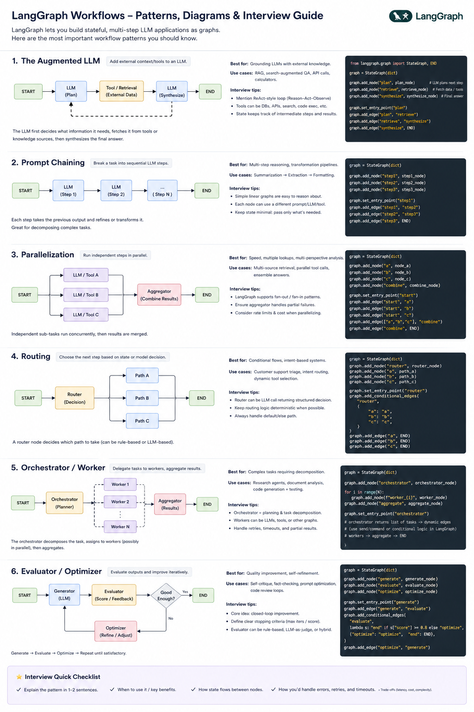

Here is a quick overview of what is covered in the document to help you study:

1. The Augmented LLM
Concept: Adding memory (like Vector DBs for RAG) and tools (calculators, web search) to a standard LLM to overcome the limitations of its static training data.

Interview Tip: Focus on how this reduces hallucinations and grounds the model in factual data, though it comes at the cost of added retrieval latency.

2. Prompt Chaining
Concept: Breaking a large task down into a sequential series of smaller LLM calls, where the output of step A becomes the input of step B.

Interview Tip: Mention that LLMs perform much better on narrow, single-focus tasks than massive multi-step prompts. This increases reliability but increases overall wait times (latency).

3. Parallelization
Concept: A Map-Reduce pattern. Running multiple independent LLM tasks at the exact same time, and then having a final step aggregate them.

Interview Tip: This is the primary architectural solution for decreasing latency when processing multiple documents or sub-tasks concurrently.

4. Routing
Concept: Using a classifier (either an LLM or an embedding similarity search) to look at a user's prompt and send it down the most efficient, specialized workflow.

Interview Tip: Routing saves compute costs. You don't want to trigger an expensive multi-agent orchestrator for a simple "Hello" or "Reset my password" intent.

5. Orchestrator/Worker
Concept: A centralized "Manager" LLM receives a complex goal, creates a plan, and delegates sub-tasks to specialized "Worker" LLMs, synthesizing their outputs at the end.

Interview Tip: Discuss the importance of state management in this pattern (which is exactly what LangGraph excels at). A major challenge here is preventing infinite loops if the orchestrator gets confused.

6. Evaluator/Optimizer
Concept: A reflection loop. An Actor LLM generates a response, a Critic LLM evaluates it against a rubric, and if it fails, it provides feedback back to the Actor to try again.

Interview Tip: This drastically improves output quality (especially in coding or strict JSON generation tasks), but you must set a "maximum loop count" to prevent infinite execution and high API costs.

You can download the .md file above for your personal notes! Let me know if you want to dive deeper into how to implement any of these specifically in LangGraph code.

Gemini is AI and can make mistakes.

# LangGraph Workflows: Interview Preparation Guide

This document breaks down the fundamental LLM workflows often built using LangGraph (or similar agentic frameworks). Understanding these patterns, their trade-offs, and when to use them will significantly help you in AI/ML engineering interviews.

---

## 1. The Augmented LLM

**Concept:**
An Augmented LLM is a foundational setup where a standard Large Language Model is enhanced with external capabilities. Instead of relying solely on its pre-trained weights, the LLM is connected to tools (like calculators, web search, or APIs) and memory (like a vector database for RAG - Retrieval-Augmented Generation).

**How it Works:**
* **Input:** User asks a question.
* **Retrieval/Tool Call:** The system fetches relevant context or runs an external function.
* **Generation:** The LLM generates a response using both the original prompt and the external data.

**Interview Talking Points:**
* **Trade-offs:** Increases accuracy and reduces hallucinations, but adds latency due to external retrieval/tool execution.
* **Keyword to mention:** *Retrieval-Augmented Generation (RAG)*, *Tool Calling/Function Calling*.

---

## 2. Prompt Chaining

**Concept:**
Prompt chaining breaks down a complex task into a sequence of smaller, manageable LLM calls. The output of one step becomes the direct input for the next step.

**How it Works:**
* **Step 1:** LLM extracts key entities from a document.
* **Step 2:** LLM takes those entities and searches for their definitions.
* **Step 3:** LLM formats the definitions into a final report.

**Interview Talking Points:**
* **Why use it?** Improves reliability. LLMs perform better on narrow, specific tasks than on massive, multi-step instructions in a single prompt.
* **Trade-offs:** Higher latency (sequential execution means you wait for step 1 before step 2 starts) and higher cost (multiple token round-trips).

---

## 3. Parallelization

**Concept:**
When a task can be divided into independent sub-tasks, you can run multiple LLM calls at the same time and combine the results at the end. 

**How it Works:**
* **Map:** A request is split into multiple parts (e.g., summarizing 5 different articles).
* **Execute:** 5 LLMs summarize the 5 articles concurrently.
* **Reduce:** A final LLM aggregates the 5 summaries into a single master summary.

**Interview Talking Points:**
* **Why use it?** Massively reduces latency compared to sequential chaining. 
* **Keywords to mention:** *Map-Reduce*, *Concurrency*, *Fan-out / Fan-in*.
* **Watch out for:** Rate limits on the LLM provider API when bursting multiple requests at once.

---

## 4. Routing

**Concept:**
Not every query requires the same processing path. Routing uses a lightweight classifier (often a smaller, faster model or a specific prompt) to determine the intent of the input and direct it to the appropriate specialized workflow.

**How it Works:**
* **Input:** "How do I reset my password?"
* **Router:** Classifies as `Technical Support`.
* **Execution:** Routes the request specifically to the IT troubleshooting agent, bypassing the Sales or General Chat agents.

**Interview Talking Points:**
* **Why use it?** Efficiency and cost savings. You don't need to run a complex, expensive workflow for a simple question.
* **Architecture:** Can be implemented with strict rules, semantic similarity (embeddings), or an LLM acting as a judge.

---

## 5. Orchestrator/Worker (Supervisor Pattern)

**Concept:**
This is an advanced agentic pattern. A central "Orchestrator" LLM receives a complex goal, breaks it down into sub-tasks, and delegates them to specialized "Worker" nodes. The orchestrator tracks progress and decides when the task is complete.

**How it Works:**
* **Orchestrator:** "I need to write a research paper on quantum computing."
* **Worker 1 (Researcher):** Gathers information and returns it to Orchestrator.
* **Worker 2 (Writer):** Drafts the sections.
* **Orchestrator:** Reviews the draft, realizes the conclusion is missing, and sends it back to the Writer worker.

**Interview Talking Points:**
* **Why use it?** Excellent for open-ended, complex tasks requiring planning and tool use.
* **Challenges:** High risk of infinite loops or getting stuck if the orchestrator fails to properly synthesize the workers' outputs. Mention *state management* (which LangGraph handles perfectly via its graph state).

---

## 6. Evaluator/Optimizer (Reflection)

**Concept:**
This workflow implements a feedback loop. One LLM generates a draft, and another LLM (or the same one with a different prompt) evaluates it against specific criteria. If it fails, feedback is sent back to the generator to optimize and try again.

**How it Works:**
* **Generator:** Writes code based on user prompt.
* **Evaluator:** Reviews the code for security vulnerabilities. Finds a bug.
* **Optimizer Loop:** Evaluator sends the bug report back to the Generator, which produces V2. Loop continues until it passes.

**Interview Talking Points:**
* **Why use it?** Drastically improves output quality, especially for code generation, creative writing, or strict formatting requirements.
* **Keywords to mention:** *Self-Correction*, *Reflection*, *Actor-Critic architecture*.
* **Trade-offs:** Can be very slow and expensive due to multiple iterative cycles.

---
*Good luck with your interview preparation! Focusing on the trade-offs (Latency vs. Accuracy vs. Cost) for each pattern is the key to demonstrating senior-level architecture skills.*
LangGraph_Workflows_Docs.md
Displaying LangGraph_Workflows_Docs.md.