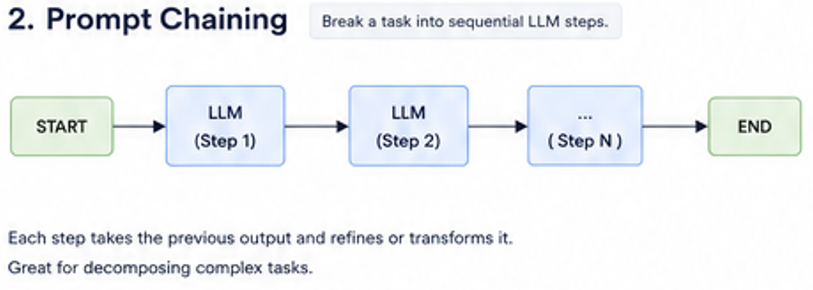

🚀 LangGraph Patterns Series (2/6): Prompt Chaining

Not every problem should be solved with a single prompt.

Sometimes, the best approach is to break a complex task into smaller, sequential steps.

This pattern is called **Prompt Chaining**.

### Basic Workflow

🟢 Input
⬇️
🧠 LLM Step 1
⬇️
🧠 LLM Step 2
⬇️
🧠 LLM Step 3
⬇️
✅ Final Output

Each step takes the output of the previous step and transforms or refines it.

---

### Why use Prompt Chaining?

Complex tasks often become more reliable when decomposed into smaller subtasks.

Instead of asking:

❌ "Read this article and create a polished LinkedIn post."

Break it down into:

1️⃣ Summarize the article.
2️⃣ Extract key insights.
3️⃣ Create bullet points.
4️⃣ Generate a LinkedIn post.
5️⃣ Refine the tone and formatting.

Smaller prompts = better control and higher quality.

---

### Why is it useful?

✔ Better reasoning
✔ Easier debugging
✔ More controllable outputs
✔ Reusable components
✔ Lower hallucination risk
✔ Higher quality responses

---

### Interview Question

**Why use Prompt Chaining instead of a single prompt?**

Answer:

Breaking a complex problem into smaller sequential steps improves reliability, modularity, and maintainability. It also makes debugging easier and allows each stage to specialize in a specific task.

