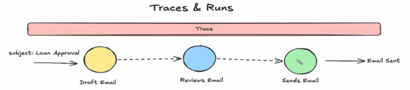

What is LangSmith?
Answer:
    - Tracing
    - Debugging
    - Monitoring
    - Evaluation
    - Feedback Collection
    - Prompt Management

### Tracs
    - Trace is a complete recored everything happen in a single invocation.

### Run Types
    - LLM: Full prompt, model's response, token usage, estimated cost, Time-to-first-token, model name & provider
    - Chain: conditional branches, parallal runable etc
    - Tool: calling extranal database, in application function, a api call etc, websearch. Tool name, Arguments, results by tool.
    - Retriever: 
    - Prompt: 